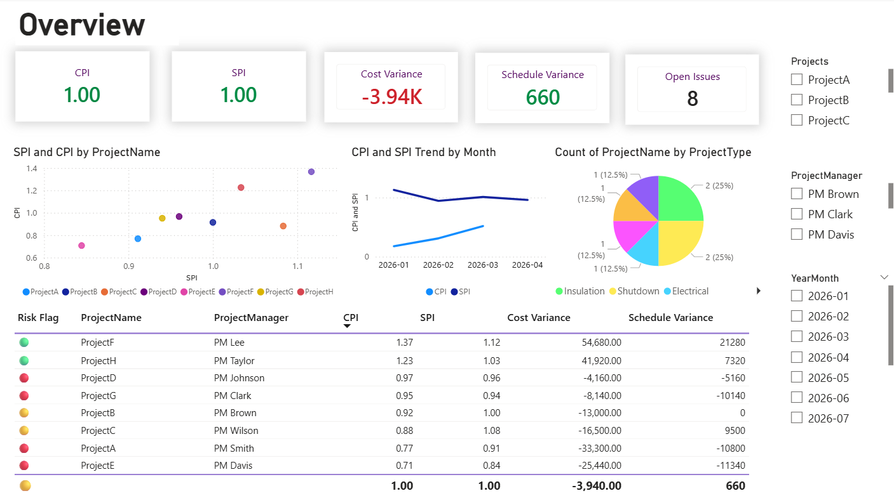
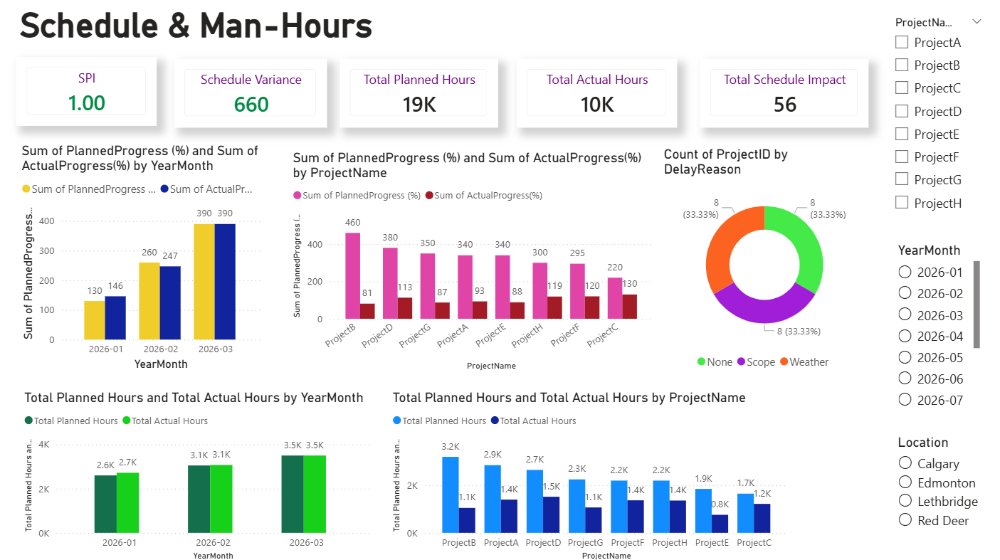
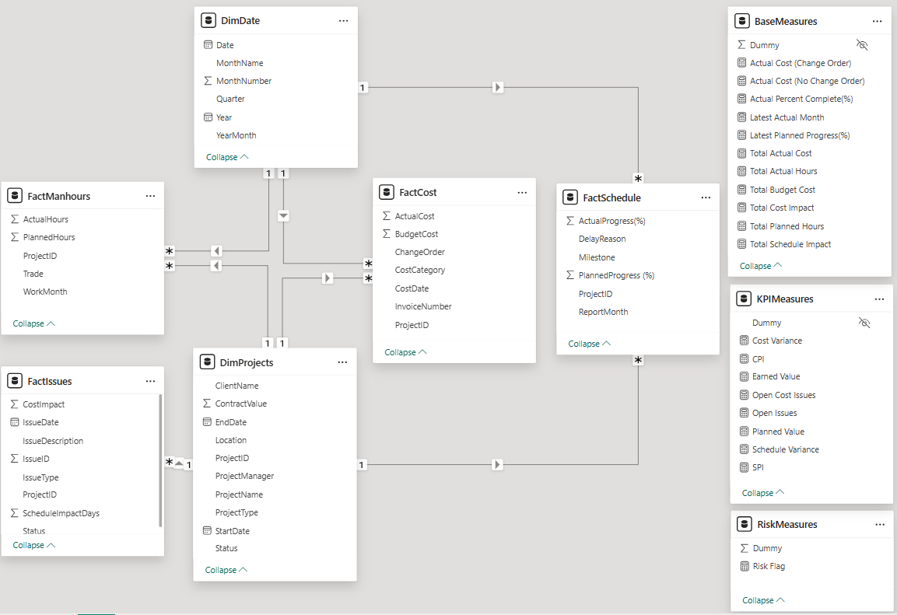
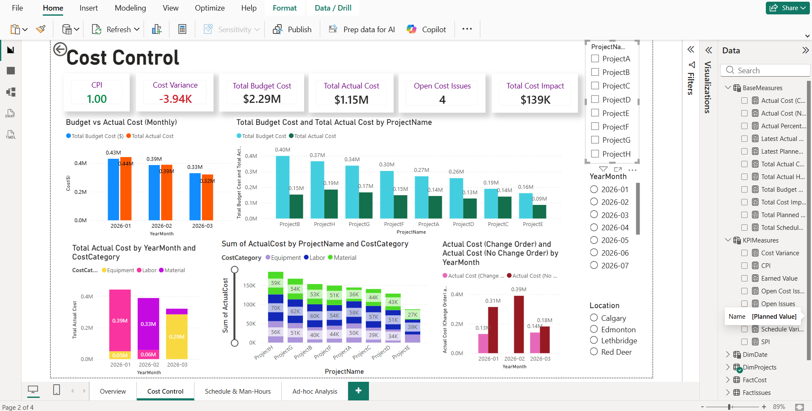

# Power Bi Project Controls Dashboard (Cost and Schedule Performance)

### Purpose 
This Power BI dashboard shows a view of project cost, schedule and risk performance for Project Managers, and Leadership teams to quickly identify underperforming projects, cost overruns, schedule delays and emerging risks.

### Pages

#### 1.Overview - Portfolio Health Monitering 
This page provides a high-level view to identify trends and outliers
* CPI, SPI, CV, SV, and Open Issues - cards
* CPI & SPI by Project - Scatter Chart
* Monthly CPI & SPI trends 
* Project distribution by Project Type
* Risk Flag table highlighting critical projects
* Interactive slicers (Project, PM, Year-Month)

#### 2. Cost Control
The Cost Control page focuses on cost control and financial performance, supporting early detection of overruns and cost drivers.
* Budget vs Actual cost tracking over time
* Cost variance analysis by project and cost category
* Separation of Change Order vs Non-Change Order costs
* Visibility into open cost issues and total cost impact

#### 3. Schedule & Man-Hours
The Schedule & Man-Hours page evaluates schedule adherence and workforce productivity.
* Planned vs Actual progress comparison
* Planned vs Actual man-hours by project and time
* Delay reason analysis
* Identification of schedule-driven cost risks

#### 4. Ad-hoc Analysis
Ad-hoc Analysis enables self-service analysis for advanced users, allowing detailed exploration across multiple dimensions.
* Fully dynamic table
* Multi-dimensional slicers (Project, PM, Cost Category, Location, Issue Type, Trade)
* Supports root cause analysis and executive follow-up questions

### Data Model & Design 
The dashboard is built on a star schema data model, separating fact tables (Cost, Schedule, Issues) from shared dimensions (Project, Date, PM, Category).

All KPIs are implemented using DAX measures to maintain calculation integrity and improve performance.

### Short Demonstation Video
<!-- <a href="https://youtu.be/xmFU9TStJh4"> -->
